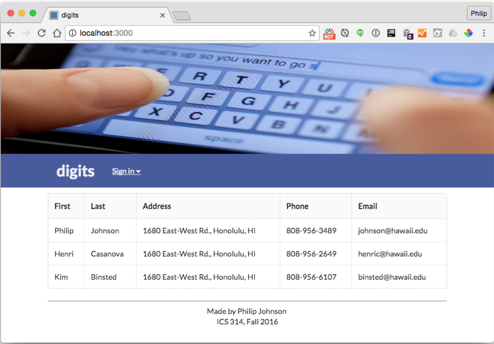
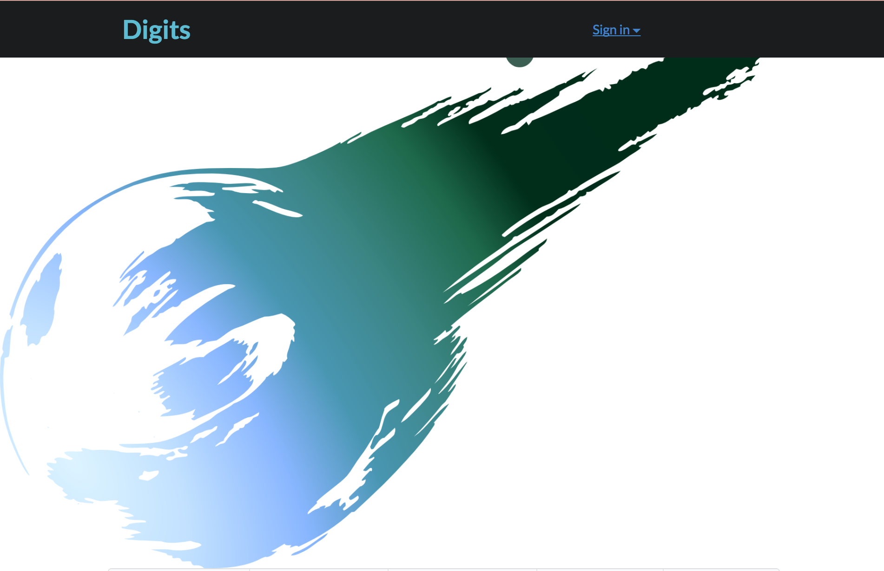

## Introduction
The purpose of this segment "Meteor Gotchas" is to demonstrate my growth and address the issues that I've encountered when using Meteor as full-stack developing platform. I will specifically address the issues I encountered when recreating the application "Digits".

## Overview of the Issues
The first Meteor problem that I've encountered during the Digits portion was manipulating the photo in the header of the application. The second problem that I've encountered was not my own, but another students problem. The reason why I see this as a problem of my own is that it is an issue that I would like to solve, as I find fixing others issues show how knowledgeful I am with the material myself.

## One Meteor Problem That You Had That You've Fixed
The first issue that I had with manipulating the photo in the header of the application was due to my lack of fine detail in the overall application. Also, it was due to my lack of knowledge of understanding how exactly the framework of Meteor comes together. The way that I solved this was rewatching the tutorial on the placement of the code to manipulate the header. I initially placed the image of the file in a different directory, rather than the one in the tutorial. This displayed my image below the header and created a subsection next to the title page rather than display the image through the entire page.

 Tutorial
 My Implementation

Eventually, I was able to fix this by placing the image source in a different area and was able to fix this!

## One Meteor Problem That You Still Need To Fix
The problem that still bothers me to this day was one, 

## Final Note
