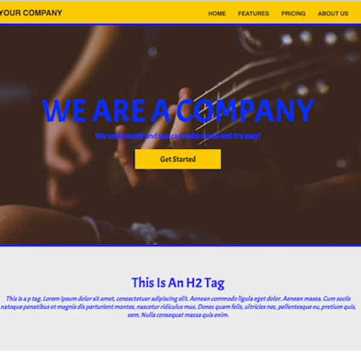

  

Styles for Hue is a collaboration by five DevLeague students from Cohort 11. It represents the culmination of our six-month endeavor from no-experience programming fledglings to full-fledged full-stack developers. We effectively implemented our skills in JavaScript, HTML, CSS, and various frameworks to create this wonderful app for hue!

This application was designed to help web developers efficiently prototype a website. It grants the user the freedom to change styles on the fly, and empowers them further with the ability to save HTML and CSS files to use on their own server. These features will lessen the already heavy workload of developers, while allowing them the flexibility to cater the code to their specific needs.

You can see our deployed website at [Styles For Hue](http://www.stylesforhue.com/).

